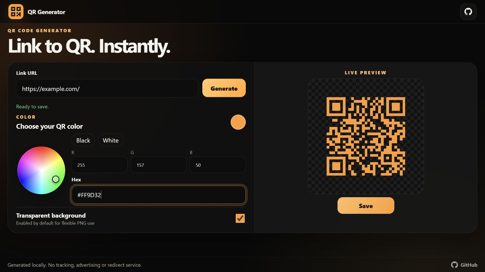

# QR Generator

English | [Deutsch](README.de.md)

A fast, installable QR code generator that runs entirely in the browser. URLs
are encoded directly without tracking, advertising, redirects, accounts, or an
external QR service.

## Version 2

Version 2 introduces a standalone browser application with a compact black and
orange interface. It replaces the local Python web server used in version 1.
The earlier implementation remains available through the Git history and the
version 1 release.

## Preview



## Features

1. Fully local QR generation in the browser
2. Automatic HTTPS completion
3. Live preview after the first generation
4. Interactive color wheel
5. Native color picker, RGB values, hex input, black and white presets
6. Transparent PNG background enabled by default
7. High error correction for reliable scanning
8. One click PNG download as `qr-code.png`
9. Responsive desktop, Android and iPhone layout
10. Installable PWA with offline application shell
11. Keyboard accessible controls and reduced motion support

## Use the app

Open `index.html` through a local web server. For example:

```powershell
npx serve .
```

Then open the local address shown in the terminal. Enter a web address, select
**Generate**, customize the QR color and transparency, and select **Save**.

The app also works as a static site on GitHub Pages or any other static host.

## Development

Node.js 18 or newer is required for rebuilding the bundled JavaScript.

```powershell
npm install
npm run check
```

`npm run check` rebuilds the browser bundle and runs the URL normalization
tests.

## Privacy

The source code and documentation contain only `example.com` as a placeholder.
Entered addresses never leave the browser. Generated files are downloaded
locally and are excluded from Git by default.

## QR code lifetime

The generated QR code has no expiration date because the destination is stored
directly in the image. It continues to work while the encoded address remains
available.

## License

This project is licensed under the MIT License. See [LICENSE](LICENSE).
